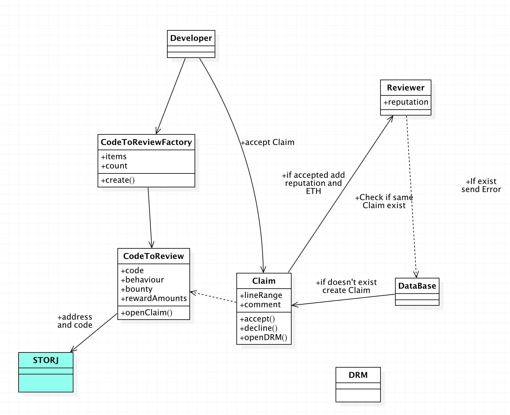

# ThirdEye backend
This repository contains the backend for ThirdEye.
The system is a redundant backing mechanism that saves the files to Storj and to mongodb.
A hash has been calculated from the main code file and is used as an identifier for the mongo and Storj record.
Mongo is used to hold on to less important information to make the application more user friendly. The actual auditing of the code, reputation of the users, payout, disputes and arbitrage is done on the blockchain. This backend serves as a relay between the blockchain and Storj. It is setup with node.js and express.js as a REST API.

## Install
Run with
  ```bash
  npm install
  node index.js
  ```
 ## API
* POST /screening -> save the code document that needs to be audited on to Storj.
* GET  /screening/:hash  -> use the hash generated by the blockchain to access the status of your audit.
* POST /claim -> update the auditing record with values from the blockchain when someone has found an error in it.
* POST /claim/check_exist -> with a lineRange(array) verify whether or not someone has already found a bug and has sent it.
* GET  /download/:bucket/:hash -> download the code file from Storj by specifying the bucket and hash
* GET  /list/:bucket -> get a list of all the buckets(users)
* POST /org_logo -> send an organisational logo to the server to personalize your page on the website.
* GET  /org_logo -> get the image back from the website
* POST /codeUpload/:userId -> save code to Storj

 ## Architecture
<p>
  
</p>
